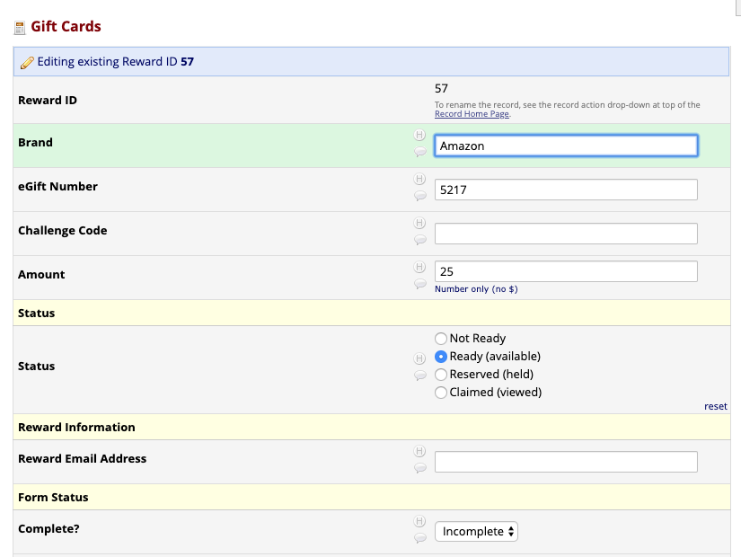
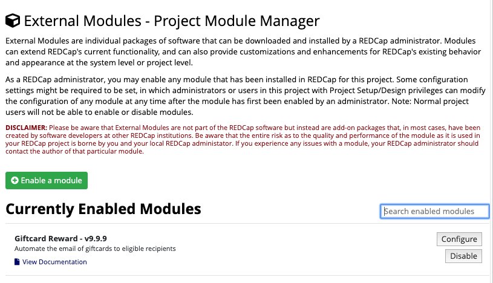
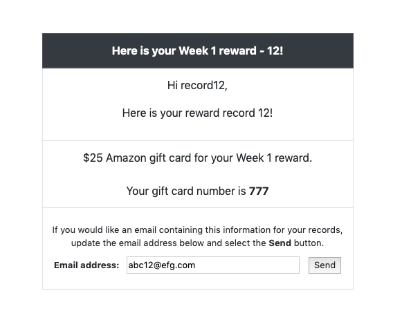
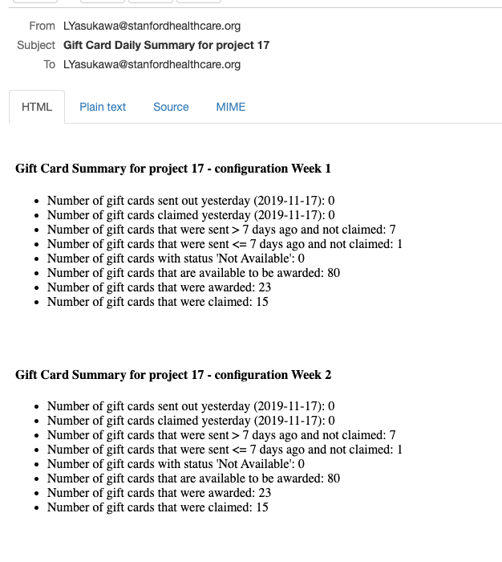
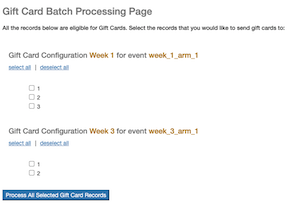

# Gift Card Rewards

This module will automate the dispersement of gift cards for use in projects offering rewards.

This module requires two REDCap projects: 1) the project where study data is stored (study project), and 2) a gift card library 
repository project where gift cards are loaded for dispersement (library project).  These two projects work in tandem to disperse
gift cards at the proper time as specified by logic in the configuration file.  The gift card library project can be used for more
than one gift card study project.

The module must be enabled for the study project (not the gift card library). 

# Overview
This module is designed to evaluate project specific logic when a record is saved. When the logic becomes true, a reward is
processed for the participant. The reward processing consists of looking for an available gift card in the library project and setting
the status of the reward to Reserved and saving a Reserved timestamp.  An available gift card is determined
from the configuration file.  The configuration file can specify a gift card denomination to give for each
timepoint and gift cards can be filtered by brand. The brand filter is performed by creating a radio button 
in the study project to hold the brands available for distribution.  The description of each radio
selection must match the brand entered in the library project. Using a radio button will hopefully reduce
input errors. The denomination amount entered should only include the dollar amount and not the dollar sign (20 and not $20.00).

A few other items of information are also saved in the library project when a reward is distributed, such as,
the name of the reward (which is saved in the study project configuration), and the record in the study project that is 
being awarded the reward. An unique token is generated for each reward. This unique token is sent to the recipient so they can
retrieve their gift card. 

The study project will save the 'Reserved' status of the gift card and the record of the library project which contains the reward being sent to this
participant. An email is sent to the participant with a link to a webpage that will display their reward. The email sent can
be customized with information stored in the project through the use of piping. This information is stored in the 
configuration file.

Once the participant clicks on the email link, a webpage will be launched that contains their reward code.  From this webpage, participants
will be able to email that reward code to themselves (or someone else) so they have a copy of the code. The email address that is sent a copy of the
reward code will be stored in the library project.

This module is able to send multiple rewards per project.  For instance, if your study specifies granting a reward after filling out a Baseline
Questionnaire, after Week 3 and at the end of the study, each of these reward timeframes can be setup in the gift card configuration. There
are no limits to the number of rewards one study project can gift.  Each reward configuration must use the same library project.

A new feature to this module is the ability to evaluate the reward logic from a cron job once a day at 9am.  When this option is selected in 
the configuration setup, a cron job will run at 9am each day to evaluate gift card logic and determine if participants qualify for a reward.
The use case for using a cron job is when logic is date dependent.

Another way to send out gift cards is to batch process them.  When batch processing is enabled, records will not be evaluated
for gift cards during a save.  Instead, an External Module webpage is provided to display which records are ready for gift cards
and only those records selected on the webpage will be processed and sent a card.  Batch Processing can be used to rate limit 
the number of cards that go out each day or it can provide extra time to ensure each record is valid before sending out rewards.

Unless a project opts out, there is a daily summary that is sent to the Alert Email address which summarizes the status of the gift card
dispersement for the previous day.  If more than one configuration is setup for a study project, one email will be sent summarizing all
setups.

# Gift Card Library Setup
The gift card library project must have the following fields:

There is an xml and csv template in Github which <b>should</b> be used for the library project. The gift card information, 
which is dispersed to participants, can be imported into the project from a csv file.

The gift card library project supports sending participants the actual reward code so they can redeem the reward.  It also
supports a link to a third party website where they can redeem the reward.  If the value entered in the 
<i>[egift_number]</i> field starts with 'http', then the value of the field will be setup as a link in the email so
participants can click on the link to retrieve their reward. When using links, the redemption of the reward is outside
of Redcap so the status of the reward will stay at 'Reserved' and will not change to 'Claimed'.

When the reward is an alphanumeric string, then Redcap will track when the user clicks on the link in the email and turns
the status to 'Claimed'.

If a gift card was erroneously sent out, the gift card record can be reset to 'Ready' and the record can be re-used. The
gift card can only be redeemed with a valid token so if the token is deleted, that gift card can no longer be 'Claimed'.

Once the module is enabled for the gift card project, the External Module configuration file must be filled out.

To setup a gift card configuration for a project, there are 3 main sections, described below.

### Reward Library

The Reward Library section requires you to enter information on the location of the library project. This project can be used for more than one
gift card project configuration but the same library project must be used for each reward of the study project.

### Reward Configuration

There may be many configurations created if there are multiple rewards dispersed by this project.
Each configuration requires information about the specific reward. Among the required information are the reward logic, reward title and the
field which holds the email address of the participant.

### Notification Settings

The Notification Settings section determines when notifications will be sent to the study project Alert Email. 
For instance, you can specify at which point you would like to be notified when the gift card inventory drops
below a threshold.

# Reward Processing

Each time a record is saved in the Gift Card Project, a check will be performed to see if the participant is eligible for a reward. 
Once a participant is found eligible, the following steps will be performed:

    1) An unused reward record meeting the monetary (and brand) requirement(s) in the Gift Card Library, will be placed in Reserved status for this card entry.
    2) The participant will receive an email with a link included to their reward gift card
    3) Once the participant clicks on the link, the reward will be display on a webpage
    4) The Gift Card Library project record will update the status of the record to Claimed with a timestamp
    5) The Gift Card Project record will update the reward status to Claimed
    
Once the participant clicks on the link received in the rewards email, the reward display appears as follows:

Participants have the option to send themselves or someone else a copy of the reward number for future reference.

#Cron Processing

There are 2 cron jobs running daily:

### Gift Card Summary

The Summary cron job will send a daily update at 6am to the Alert Email address specified in the configuration file.  The nightly summary 
displays the following data:

### Logic Checker

The Logic Checker cron job will run at 9am each morning and look for the configurations who have the "Enable 9am cron 
job to check logic" checkbox enabled. Configurations should enable this cron logic checker only when they have a date 
component to their reward logic.  This cron will ensure the
reward is sent on the appropriate date even if the record is not saved on the day it is eligible.

### Batch Processing

The Batch Processing webpage will display all records that are ready for a reward for each configuration that has 
selected batch processing. The user will be able select the records that should receive the reward for each configuration.

# Future Enhancements
    - Add the ability for projects to download a standard Gift Card Library Template automatically